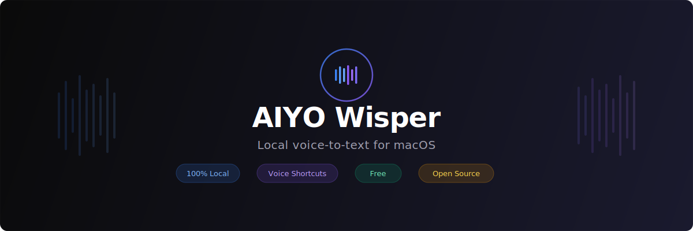

<p align="center">
  
</p>

Hold a key, speak, text appears at your cursor. Select text and speak a command to transform it. No cloud. No subscription. Everything runs on your Mac.

[](LICENSE)

[**Download DMG**](https://github.com/ayal/aiyo-wisper/releases/latest) · [Build from Source](#build-from-source)

---

## What it does

**Dictation** — Hold Control, speak, release. Text appears wherever your cursor is. In any app.

**AI Cleanup** — A local AI model removes filler words ("um", "like"), fixes self-corrections ("no wait, I mean..."), and adds punctuation. Automatically.

**Command Mode** — Select text, hold Option, speak a command:
- "make this more formal"
- "fix the grammar"
- "translate to Russian"
- "rewrite as bullet points"
- "make this shorter"

The selected text gets replaced with the transformed version.

**Voice Shortcuts** — Create trigger phrases that expand during dictation. Say "my email" and it types your full email address.

## How it compares

| | AIYO Wisper | Ghost Pepper | SuperWhisper |
|---|:---:|:---:|:---:|
| Local processing | Yes | Yes | Cloud |
| Command mode | Yes | — | — |
| Voice shortcuts | Yes | — | — |
| AI text cleanup | Yes | Yes | — |
| Default download | 613 MB | ~3.5 GB | N/A |
| Price | **Free** | Free | $10/mo |
| Open source | MIT | MIT | No |

## Requirements

- macOS 15.0+
- Apple Silicon (M1 or later)

## Install

1. Download the latest DMG from [Releases](https://github.com/ayal/aiyo-wisper/releases/latest)
2. Drag to Applications
3. Launch — grant Microphone and Accessibility permissions
4. Pick a speech model in Settings → Transcription

## Models

| Model | Size | Best for |
|-------|------|----------|
| **Small** (default) | 216 MB | Best balance of speed and quality. All languages. |
| Turbo | 632 MB | Highest accuracy. All languages. |
| English Turbo | 600 MB | Fastest and most accurate for English only. |
| Lightweight | 77 MB | Smallest download. Quick notes. All languages. |

AI text cleanup uses **Qwen3 0.6B** (397 MB) — downloaded separately in Settings → Formatting.

## Privacy

**No audio or text ever leaves your device.** All speech recognition (WhisperKit) and AI cleanup (Qwen3 via llama.cpp) run entirely on your Mac using the Neural Engine and GPU. No cloud APIs, no telemetry, no accounts.

## Build from Source

```bash
brew install xcodegen
git clone https://github.com/ayal/aiyo-wisper.git
cd aiyo-wisper
xcodegen generate
open AiyoWisper.xcodeproj
# Cmd+R to build and run
```

## Tech Stack

| Component | Technology |
|-----------|-----------|
| Language | Swift 6 |
| UI | SwiftUI |
| Speech-to-text | [WhisperKit](https://github.com/argmaxinc/WhisperKit) (CoreML) |
| AI cleanup | [LLM.swift](https://github.com/eastriverlee/LLM.swift) + Qwen3 0.6B |
| Text injection | CGEvent keyboard simulation |
| Auto-update | [Sparkle](https://sparkle-project.org/) |

## License

MIT — see [LICENSE](LICENSE).
